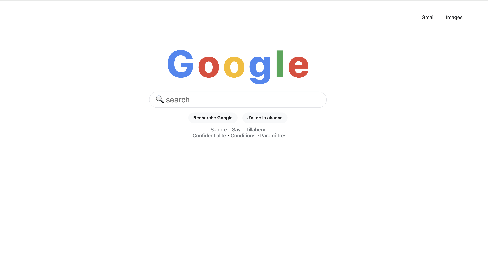
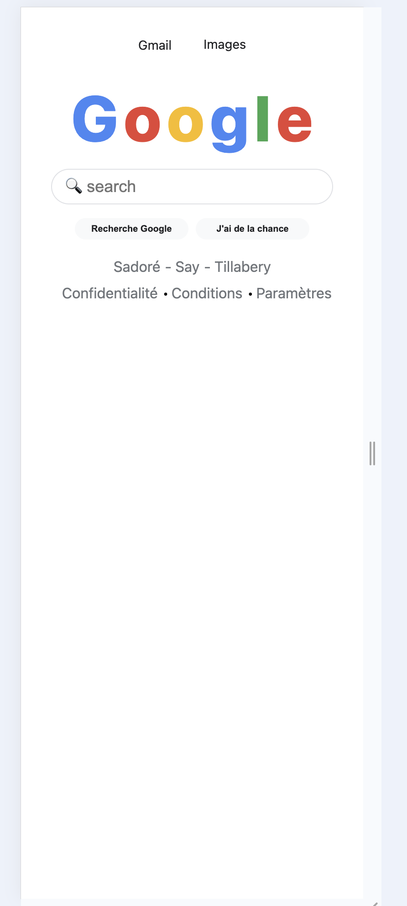

#  Projet : Page d’accueil type Google

##  Description
Ce projet reproduit la **page d’accueil de Google** avec **HTML et CSS pur**.  
L’objectif est de pratiquer :
- la structuration d’une page web simple,  
- le positionnement **flexbox**,  
- la **responsivité** avec `rem`, `vh`, `%`, et la fonction `clamp()`.

Le design s’adapte à tous les écrans (mobile, tablette, ordinateur) grâce à une **typographie fluide** et aux **media queries**.

## Technologies utilisées
- **HTML5**
- **CSS3 (Flexbox + Responsive Design)**

---

## Aperçu
Une page d’accueil minimaliste inspirée de Google :
- Logo coloré
- Barre de recherche centrée
- Deux boutons interactifs
- Liens de bas de page avec points de séparation

---

## Lancer le projet
1. Ouvre le dossier du projet.
2. Double-clique sur `index.html` → la page s’ouvre dans ton navigateur.
3. Redimensionne la fenêtre pour voir le design **s’adapter automatiquement**

---

## 🧩 Auteur
ALHER MATAOU Abdallah 

## Liens :

- Repo : https://github.com/Abdallah-Alher/Google_Home_Page.git
- Page : https://abdallah-alher.github.io/Google_Home_Page/

## Captures :

